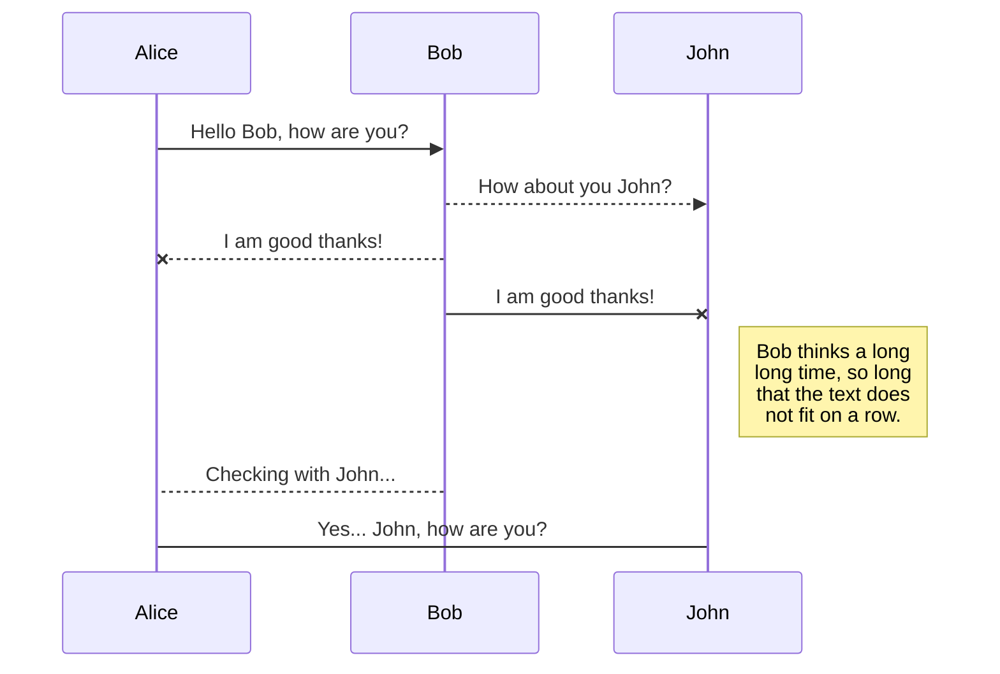
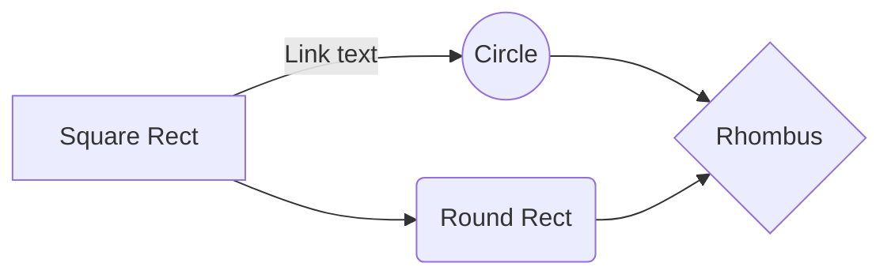

# Automation project - Team 2

The focus of this project is to build a functional Webex bot, capable of parsing CSV documents. Total functionality is expanded using commands. 

## Dependencies
This project uses the webex_bot library by Finbarr Brady (fbradyirl). This library is available at: https://github.com/fbradyirl/webex_bot
Also uses the official community webexteamssdk available at: https://github.com/CiscoDevNet/webexteamssdk
The core files webex_bot.py and webex_websocket_client.py have been modified to allow receiving messages with attachments.

# Usage

This project can be run either standalone or via a Docker container. Docker container requiress building the image manually at the moment. Please check the following sections for more information.

## Standalone
Requirements:

 - Python 3.9 or above (tested on Python 3.9 and 3.11)
 

It is highly recommended to use a virtual environment to run the dependencies. Virtualenv was used for development. 

Clone the project repository and install the required dependencies

    pip install -r requirements.txt
  
  Run the project directly using python
  

    python3 ILSEH.py

Project requires your bot access token. Set the access token using an special environmental variable. This behavior is directly inherited from the webexteamssdk

    export WEBEX_TEAMS_ACCESS_TOKEN=<your bots token>

## Docker

1. Clone the repository.
2. Replace the environment variable for the bot's access token by editing the included *variables.env* file
3. Build the current Docker image via the included Dockerfile

       docker build -t [image_name] .
      Replace [image_name] with your own name. Remeber to use descriptive names. This will be used in the next sextion.
4. Run the container using the built image

    `docker run --name [container_name] --env-file variables.env [image_name]`
    Replace [container_name] with your own name, and replace [image_name] with the image name from 3.

# Team 2

 - Barrios Fernando
 - Chávez Sánchez Juan Daniel
 - Córdoba Gómez Rodrigo
 - Espinosa Fernando
 - Flores Constantino Diego
 - Gomora Angélica

# Markdown extensions

StackEdit extends the standard Markdown syntax by adding extra **Markdown extensions**, providing you with some nice features.

> **ProTip:** You can disable any **Markdown extension** in the **File properties** dialog.

## SmartyPants

SmartyPants converts ASCII punctuation characters into "smart" typographic punctuation HTML entities. For example:

|                |ASCII                          |HTML                         |
|----------------|-------------------------------|-----------------------------|
|Single backticks|`'Isn't this fun?'`            |'Isn't this fun?'            |
|Quotes          |`"Isn't this fun?"`            |"Isn't this fun?"            |
|Dashes          |`-- is en-dash, --- is em-dash`|-- is en-dash, --- is em-dash|

## KaTeX

You can render LaTeX mathematical expressions using [KaTeX](https://khan.github.io/KaTeX/):

The *Gamma function* satisfying $\Gamma(n) = (n-1)!\quad\forall n\in\mathbb N$ is via the Euler integral

$$
\Gamma(z) = \int_0^\infty t^{z-1}e^{-t}dt\,.
$$

> You can find more information about **LaTeX** mathematical expressions [here](http://meta.math.stackexchange.com/questions/5020/mathjax-basic-tutorial-and-quick-reference).

## UML diagrams

You can render UML diagrams using [Mermaid](https://mermaidjs.github.io/). For example, this will produce a sequence diagram:

And this will produce a flow chart:

